# System Overview — C4 Context & Container Diagrams

> **UML Standard:** C4 Model (Context → Container → Component → Code)
> **Rendered with:** Mermaid (GitHub-native)

---

## Level 1 — System Context Diagram

Shows DataMind in relation to external actors and systems.

---

## Level 2 — Container Diagram

Shows all major deployable units inside DataMind.

```mermaid
C4Container
    title DataMind — Container Diagram

    Person(user, "User", "Analyst / Data Scientist / Admin")

    Container_Boundary(frontend, "Frontend Layer") {
        Container(web, "Next.js 15 App", "React 19, Tailwind v4", "Dashboard builder, NL query UI, Workbench, Admin portal")
        Container(weblm, "WebLLM", "WASM/WebGPU", "Browser-local Phi-3.5-mini — chart suggestions, PII pre-screen")
    }

    Container_Boundary(gateway_layer, "API Gateway Layer") {
        Container(kong, "Kong API Gateway", "Kong 3.x", "Rate limiting, auth, routing, plugin pipeline")
        Container(litellm, "LiteLLM Proxy", "Python", "Unified LLM routing across 6 providers, cost tracking, Langfuse callback")
    }

    Container_Boundary(agent_layer, "Multi-Agent Orchestration") {
        Container(langgraph, "LangGraph Orchestrator", "Python / LangGraph", "Workforce Manager: goal decomposition, worker assignment, parallel execution")
        Container(crewai, "CrewAI Agent Teams", "Python / CrewAI", "Intake, Cleaning, Analytics, Reporting specialist teams")
        Container(autogen, "AutoGen CriticAgent", "Python / AutoGen", "Chain-of-thought verification, meta-evaluation, self-correction loops")
        Container(adk, "Google ADK DS Team", "Python / ADK + Vertex", "Hypothesis, CausalInference, FeatureEngineering, ModelTraining agents")
    }

    Container_Boundary(mcp_layer, "FastMCP Tool Servers") {
        Container(mcp_python, "mcp-python-sandbox", "Go/Python", "Secure code execution, NLI faithfulness scorer, structured output")
        Container(mcp_sql, "mcp-sql-executor", "Go", "NL-to-SQL, query execution, numerical verification")
        Container(mcp_viz, "mcp-visualization", "Node.js", "25+ chart types via ECharts/D3.js/deck.gl")
        Container(mcp_kb, "mcp-knowledge-base", "Python", "MMR RAG, hybrid retrieval, GraphRAG, temporal grounding")
        Container(mcp_report, "mcp-report-generator", "Python", "Narrative generation, PDF/PPTX, Merkle provenance, IPFS anchoring")
        Container(mcp_dbt, "mcp-dbt-runner", "Python", "dbt model execution, lineage, data contracts")
        Container(mcp_connector, "mcp-data-connector", "Go", "80+ source connectors, CDC, Kafka publishing")
    }

    Container_Boundary(inference_layer, "AI Inference Layer") {
        Container(vllm, "vLLM Server", "Python/CUDA", "Local 70B/32B models, speculative decoding, PagedAttention")
        Container(ollama, "Ollama SLM", "Go", "Phi-3.5-mini, Gemma-2-2B — intent classify, complexity score")
        Container(slm_router, "SLM Router", "Python", "Query routing logic: edge→SLM→cloud LLM→RLM tier escalation")
        Container(cf_workers, "Cloudflare Workers AI", "JS/WASM", "Edge inference at 300+ PoPs — Llama 3.2 3B, Phi-3.5-mini")
    }

    Container_Boundary(data_layer, "Data & Storage Layer") {
        ContainerDb(postgres, "PostgreSQL 16", "pgvector + TimescaleDB", "Tenant data, agent memory, metadata, audit logs")
        ContainerDb(clickhouse, "ClickHouse", "OLAP", "Analytics queries, materialised views, Langfuse traces")
        ContainerDb(qdrant, "Qdrant", "Vector DB", "Embeddings, MMR retrieval, worker long-term memory")
        ContainerDb(redis, "Redis 7", "Cache", "Session state, query result cache (60s TTL), rate limiting")
        ContainerDb(kafka, "Apache Kafka", "Streaming", "Event bus — agent comms, CDC events, real-time ingestion")
        ContainerDb(minio, "MinIO / S3", "Object Storage", "Raw files, model artifacts, Iceberg table data, reports")
        ContainerDb(iceberg, "Apache Iceberg", "Lakehouse", "ACID table format on MinIO, time-travel, schema evolution")
        ContainerDb(neo4j, "Neo4j", "Graph DB", "GraphRAG entity graphs, data lineage DAG, knowledge graph")
        ContainerDb(mongo, "MongoDB", "Document DB", "Episodic agent memory, unstructured logs, event store")
    }

    Container_Boundary(observability, "Observability Stack") {
        Container(langfuse, "Langfuse", "Self-hosted", "LLM tracing, prompt versioning, eval scoring, cost analytics")
        Container(otel, "OpenTelemetry Collector", "OTLP", "Unified telemetry collection → Jaeger, Prometheus, Loki")
        Container(grafana, "Grafana", "Dashboards", "Infrastructure + LLM SLO dashboards, SLA alerting")
        Container(flink, "Apache Flink", "Streaming", "Stateful CEP, sessionisation, Iceberg streaming sink, anomaly detection")
    }

    Rel(user, web, "HTTPS/WSS")
    Rel(web, kong, "HTTPS")
    Rel(kong, litellm, "gRPC/REST")
    Rel(kong, langgraph, "gRPC/REST")
    Rel(litellm, vllm, "REST")
    Rel(litellm, ollama, "REST")
    Rel(langgraph, crewai, "Python call")
    Rel(langgraph, autogen, "Python call")
    Rel(langgraph, adk, "Python call")
    Rel(crewai, mcp_python, "MCP protocol")
    Rel(crewai, mcp_sql, "MCP protocol")
    Rel(crewai, mcp_viz, "MCP protocol")
    Rel(crewai, mcp_kb, "MCP protocol")
    Rel(crewai, mcp_report, "MCP protocol")
    Rel(mcp_sql, clickhouse, "TCP")
    Rel(mcp_kb, qdrant, "gRPC")
    Rel(mcp_connector, kafka, "Kafka Producer")
    Rel(flink, iceberg, "Iceberg Sink")
    Rel(langfuse, clickhouse, "ClickHouse writer")
    Rel(otel, grafana, "OTLP")
```

---

## Level 2 — Technology Stack Map

