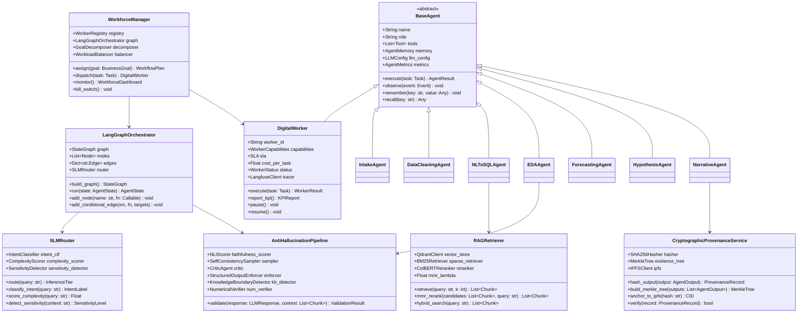
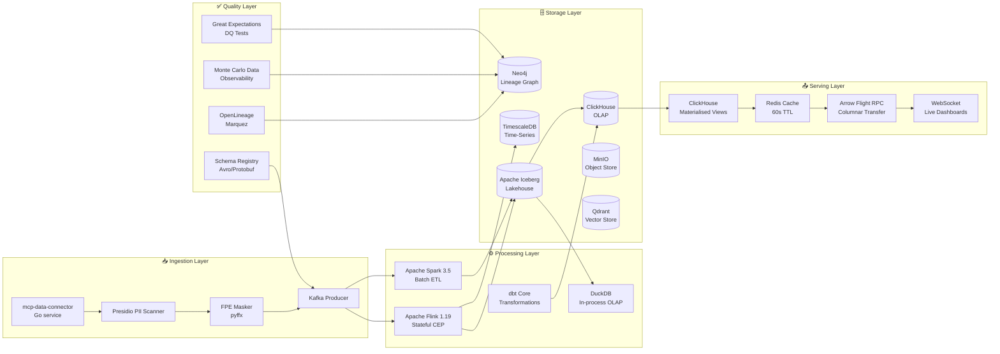
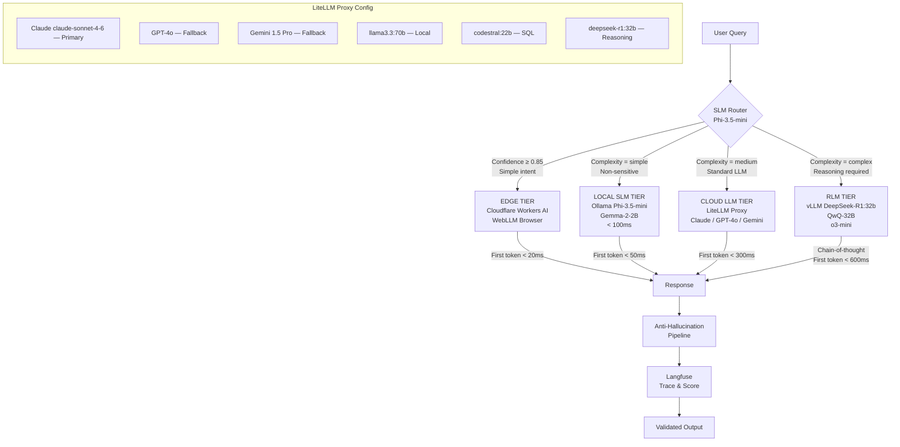
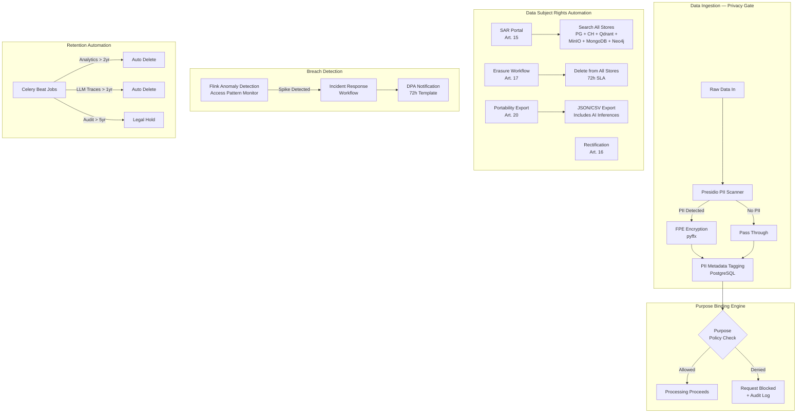
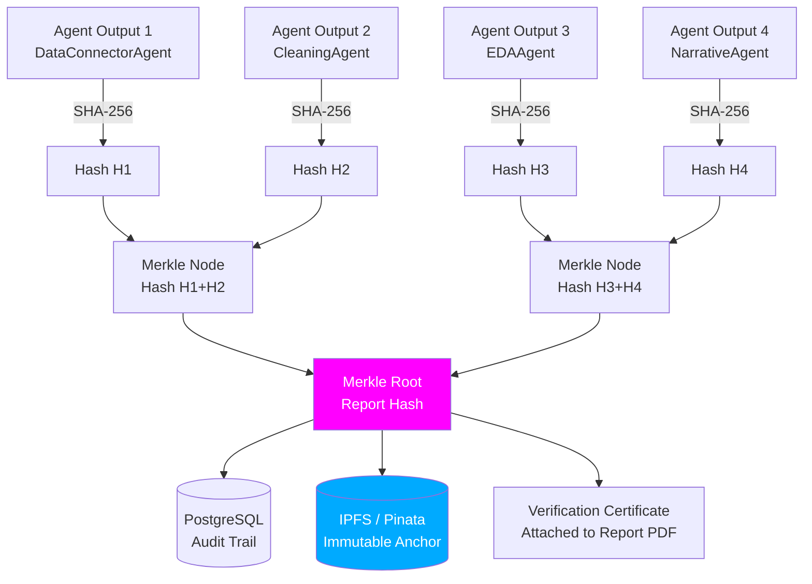

# Component & Class Diagrams

> UML 2.5 Component and Class diagrams for each bounded domain.
> Rendered with Mermaid.

---

## 1. Agent Orchestration — Class Diagram

---

## 2. Data Pipeline — Component Diagram

---

## 3. LLM Inference Tiers — Component Diagram

---

## 4. GDPR Privacy Architecture — Component Diagram

---

## 5. Verifiable AI — Merkle Provenance Chain

