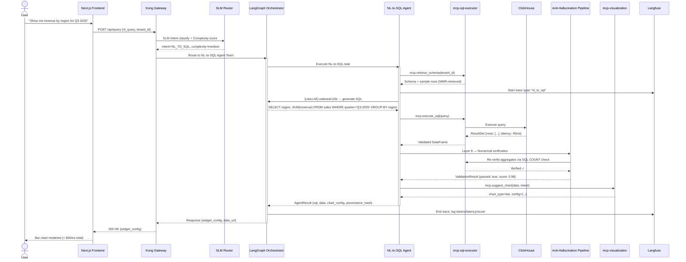
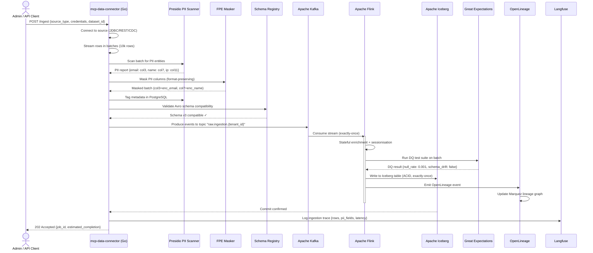
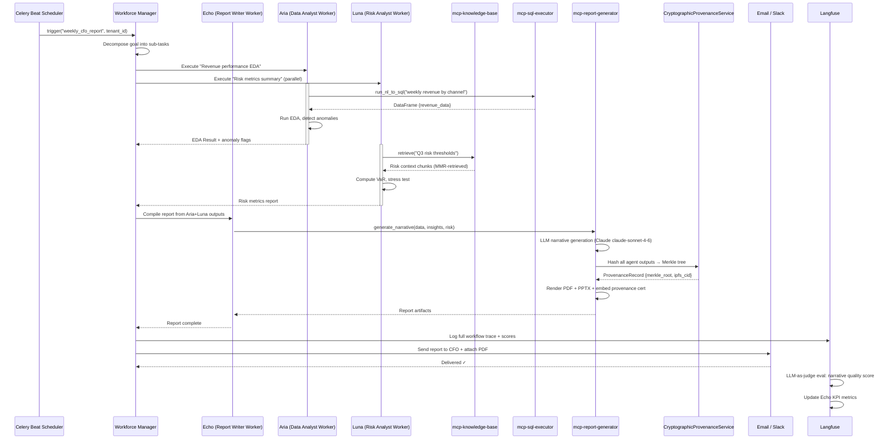
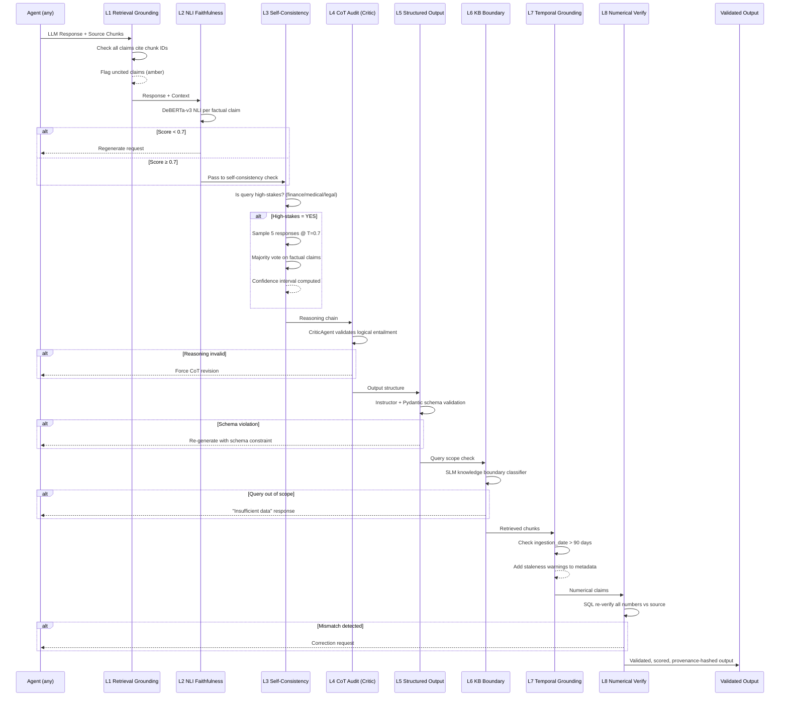
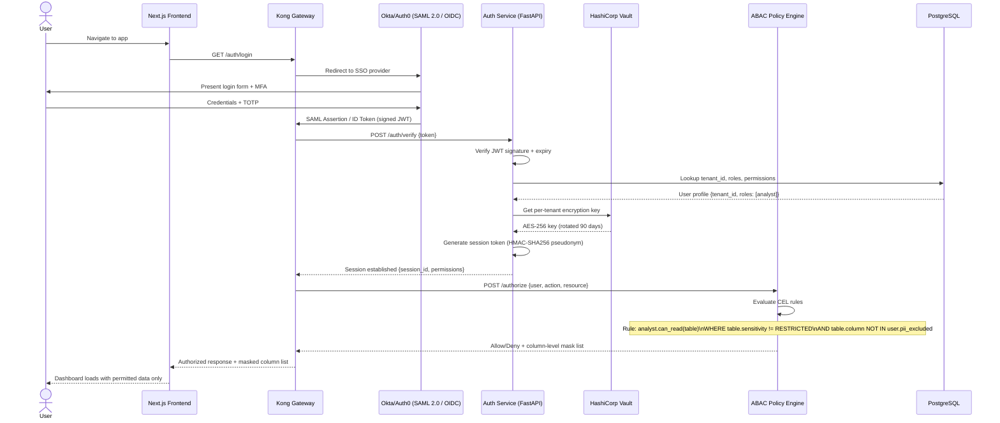

# Sequence Diagrams — Key User Journeys

> UML 2.5 Sequence Diagrams for the five most critical platform flows.
> Rendered with Mermaid.

---

## 1. Natural Language Query → Validated SQL → Dashboard Widget

---

## 2. Data Ingestion → PII Masking → Lakehouse Storage

---

## 3. Digital Worker Autonomous Weekly Report

---

## 4. Anti-Hallucination Validation Pipeline

---

## 5. SSO Authentication & ABAC Authorization Flow

