# Data Flow Diagrams & Entity Relationship Diagrams

---

## 1. End-to-End Data Flow — DFD Level 0


---

## 2. Agent Memory Architecture — Data Flow

```mermaid
flowchart TB
    subgraph MEMORY["🧠  4-Tier Agent Memory"]
        STM[Short-Term Memory\nRedis — Session Context\nTTL 30 min]
        LTM[Long-Term Memory\nQdrant — Semantic Search\nPersistent per Worker]
        EPI[Episodic Memory\nMongoDB — Past Task Logs\nRetention 1yr]
        SEM[Semantic Memory\nPostgreSQL pgvector\nFacts + Relationships]
    end

    A[Agent Receives Task] --> STM
    STM -->|Working context| PROC[Agent Processing]
    PROC -->|Vector similarity search| LTM
    PROC -->|Past decisions lookup| EPI
    PROC -->|Factual grounding| SEM
    PROC -->|New learnings| CONS[Memory Consolidation Agent]
    CONS -->|Summarise + compress| LTM
    CONS -->|Log episode| EPI
    CONS -->|Extract facts| SEM
```



---

## 3. Core Entity Relationship Diagram


---

## 4. Lakehouse Storage Topology

```mermaid
graph TB
    subgraph BRONZE["🟤  Bronze Layer — Raw"]
        B1[raw.ingestion.{tenant}]
        B2[Avro/JSON — exact as received]
        B3[PII masked before storage]
    end

    subgraph SILVER["⚪  Silver Layer — Cleaned"]
        S1[cleaned.{domain}.{entity}]
        S2[Parquet on Iceberg]
        S3[DQ tested, deduplicated]
        S4[Schema normalised]
    end

    subgraph GOLD["🟡  Gold Layer — Aggregated"]
        G1[mart.{domain}.{metric}]
        G2[Pre-aggregated dimensions]
        G3[Dashboard-ready]
        G4[ClickHouse import]
    end

    subgraph PLATINUM["💎  Platinum Layer — AI-Ready"]
        P1[features.{model}.{version}]
        P2[Training datasets]
        P3[Feature Store (Feast)]
        P4[Embedding snapshots]
    end

    BRONZE -->|Flink CEP + DQ| SILVER
    SILVER -->|dbt models| GOLD
    GOLD -->|Feature engineering| PLATINUM
    GOLD --> CH[(ClickHouse OLAP)]
    PLATINUM --> FS[(Feast Feature Store)]
    FS --> ML[ML Training\nAutoGluon / Axolotl]
```

---

## 5. Multi-Cloud Data Residency Flow

```mermaid
flowchart TB
    REQ[Incoming Data Request] --> CD{Conductor Policy Engine\nCEL Rules}

    CD -->|data_region=EU| AWS_EU[AWS eu-west-1\nIreland]
    CD -->|data_region=US| AWS_US[AWS us-east-1\nVirginia]
    CD -->|data_region=APAC| GCP_AP[GCP asia-east1\nTaiwan]
    CD -->|model_size > 70B| ONPREM[On-Prem GPU Cluster]
    CD -->|burst > 100 concurrent| GCP_SPOT[GCP Spot Instances\nCost Arbitrage]

    AWS_EU --> EU_ICEBERG[(Iceberg — eu-west-1\nAES-256 per-tenant key\nVault rotation 90d)]
    AWS_US --> US_ICEBERG[(Iceberg — us-east-1)]
    GCP_AP --> AP_ICEBERG[(Iceberg — asia-east1)]

    EU_ICEBERG -->|Never leaves EU| EU_CH[(ClickHouse — eu-west-1)]
    EU_CH --> EU_DASH[EU Dashboards]

    subgraph KEYS["🔐  Key Management"]
        VT[HashiCorp Vault]
        VT --> EU_KEY[EU Tenant Key\n90-day rotation]
        VT --> US_KEY[US Tenant Key]
        EU_KEY --> EU_ICEBERG
    end
```


