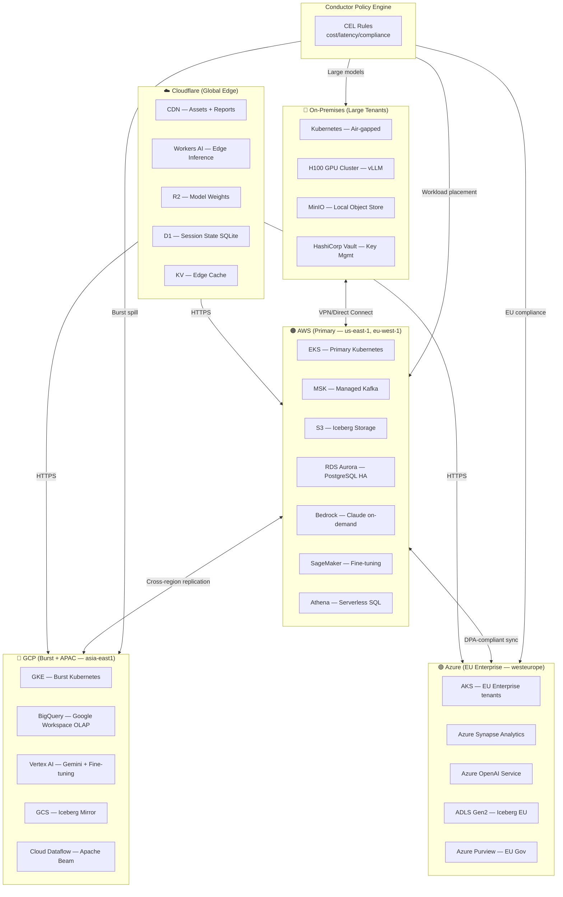
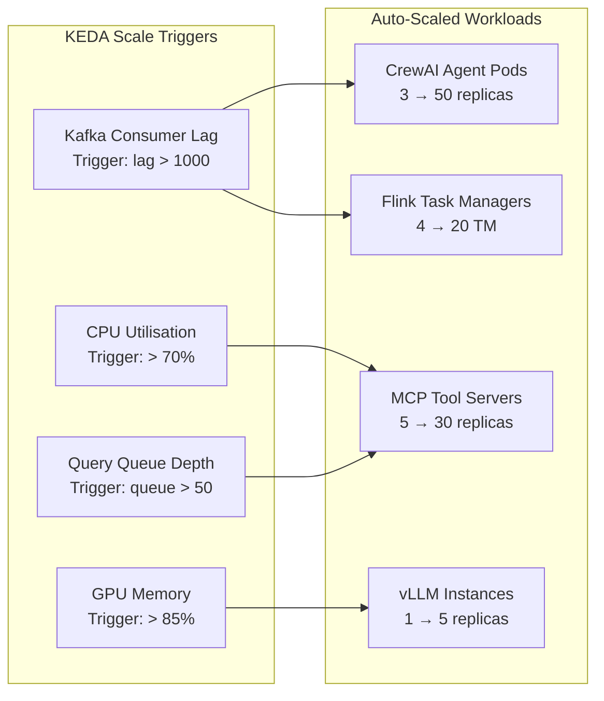

# Deployment Diagram — Kubernetes & Multi-Cloud Topology

---

## 1. Kubernetes Namespace Architecture

```mermaid
graph TB
    subgraph K8S["☸️  Kubernetes Cluster (EKS / GKE / AKS)"]
        subgraph NS_GW["Namespace: gateway"]
            KG_POD[Kong Gateway\n3 replicas\nHPA: 3-20]
            LF_SVC[LiteLLM Proxy\n2 replicas]
        end

        subgraph NS_AGENT["Namespace: agents"]
            LG_POD[LangGraph Orchestrator\n2 replicas]
            CR_POD[CrewAI Teams\n3 replicas\nKEDA: queue-driven]
            AU_POD[AutoGen CriticAgent\n1 replica]
            WM_POD[Workforce Manager\n2 replicas]
        end

        subgraph NS_MCP["Namespace: mcp-tools"]
            MCP_PY[mcp-python-sandbox\n5 replicas\nResource: 2CPU 4Gi]
            MCP_SQL[mcp-sql-executor\n3 replicas]
            MCP_VIZ[mcp-visualization\n3 replicas]
            MCP_KB[mcp-knowledge-base\n3 replicas]
            MCP_RPT[mcp-report-generator\n2 replicas]
            MCP_CON[mcp-data-connector\n3 replicas]
        end

        subgraph NS_INFER["Namespace: inference"]
            VLLM_POD[vLLM Server\n1 replica\nGPU: A100/H100]
            OLL_POD[Ollama SLM\n2 replicas\nCPU-only]
        end

        subgraph NS_DATA["Namespace: data"]
            PG_SS[PostgreSQL 16\nStatefulSet\n3 replicas HA]
            CH_SS[ClickHouse\nStatefulSet\n3 shards]
            QD_SS[Qdrant\nStatefulSet\n3 replicas]
            RD_SS[Redis Sentinel\nStatefulSet\n3 replicas]
            MG_SS[MongoDB\nStatefulSet\n3 replicas]
            KF_SS[Apache Kafka\nStatefulSet\n5 brokers]
            FL_SS[Apache Flink\nJobManager + TaskManagers]
        end

        subgraph NS_OBS["Namespace: observability"]
            LFU_POD[Langfuse\n2 replicas]
            OT_POD[OTel Collector\nDaemonSet]
            GR_POD[Grafana\n1 replica]
            PR_POD[Prometheus\nStatefulSet]
            JG_POD[Jaeger\n2 replicas]
            LK_POD[Loki\n2 replicas]
        end
    end

    subgraph ISTIO["Istio Service Mesh"]
        MTLS[mTLS between all services]
        ENV[Envoy Sidecars]
    end

    NS_GW --> NS_AGENT --> NS_MCP
    NS_MCP --> NS_DATA
    NS_AGENT --> NS_INFER
    NS_OBS -.->|scrape| NS_AGENT
    NS_OBS -.->|scrape| NS_MCP
    ISTIO -.->|inject| NS_GW
    ISTIO -.->|inject| NS_AGENT
```



---

## 2. Multi-Cloud Active-Active Topology



---

## 3. KEDA Auto-Scaling Configuration



---

## 4. Helm Chart Repository Structure

```
datamind-helm/
├── Chart.yaml
├── values.yaml
├── values-prod.yaml
├── values-dev.yaml
├── templates/
│   ├── gateway/
│   │   ├── kong-deployment.yaml
│   │   └── litellm-deployment.yaml
│   ├── agents/
│   │   ├── langgraph-deployment.yaml
│   │   ├── crewai-deployment.yaml
│   │   └── workforce-manager-deployment.yaml
│   ├── mcp-tools/
│   │   ├── mcp-python-sandbox.yaml
│   │   ├── mcp-sql-executor.yaml
│   │   └── ... (7 MCP servers)
│   ├── inference/
│   │   ├── vllm-statefulset.yaml
│   │   └── ollama-deployment.yaml
│   ├── data/
│   │   ├── postgres-statefulset.yaml
│   │   ├── clickhouse-statefulset.yaml
│   │   ├── qdrant-statefulset.yaml
│   │   ├── kafka-statefulset.yaml
│   │   └── flink-jobmanager.yaml
│   ├── observability/
│   │   ├── langfuse-deployment.yaml
│   │   ├── grafana-deployment.yaml
│   │   └── prometheus-statefulset.yaml
│   └── networking/
│       ├── istio-peer-auth.yaml
│       ├── ingress.yaml
│       └── network-policies.yaml
├── charts/
│   └── ... (sub-chart dependencies)
└── ci/
    └── helm-test.yaml
```
