# Deployment Diagram — Kubernetes & Multi-Cloud Topology

---

## 1. Kubernetes Namespace Architecture


---

## 2. Multi-Cloud Active-Active Topology

```mermaid
graph TB
    subgraph CF["☁️  Cloudflare (Global Edge)"]
        CF_CDN[CDN — Assets + Reports]
        CF_WA[Workers AI — Edge Inference]
        CF_R2[R2 — Model Weights]
        CF_D1[D1 — Session State SQLite]
        CF_KV[KV — Edge Cache]
    end

    subgraph AWS["🟠  AWS (Primary — us-east-1, eu-west-1)"]
        EKS[EKS — Primary Kubernetes]
        MSK[MSK — Managed Kafka]
        S3[S3 — Iceberg Storage]
        RDS[RDS Aurora — PostgreSQL HA]
        BED[Bedrock — Claude on-demand]
        SAG[SageMaker — Fine-tuning]
        ATH[Athena — Serverless SQL]
    end

    subgraph GCP["🔵  GCP (Burst + APAC — asia-east1)"]
        GKE[GKE — Burst Kubernetes]
        BQ[BigQuery — Google Workspace OLAP]
        VAI[Vertex AI — Gemini + Fine-tuning]
        GCS[GCS — Iceberg Mirror]
        DF[Cloud Dataflow — Apache Beam]
    end

    subgraph AZURE["🟢  Azure (EU Enterprise — westeurope)"]
        AKS_AZ[AKS — EU Enterprise tenants]
        ASYN[Azure Synapse Analytics]
        AOAI[Azure OpenAI Service]
        ADLS[ADLS Gen2 — Iceberg EU]
        PURV[Azure Purview — EU Gov]
    end

    subgraph ONPREM["🏢  On-Premises (Large Tenants)"]
        K8S_OP[Kubernetes — Air-gapped]
        GPU[H100 GPU Cluster — vLLM]
        MINIO_OP[MinIO — Local Object Store]
        VAULT[HashiCorp Vault — Key Mgmt]
    end

    CF -->|HTTPS| AWS
    CF -->|HTTPS| GCP
    CF -->|HTTPS| AZURE
    AWS <-->|Cross-region replication| GCP
    AWS <-->|DPA-compliant sync| AZURE
    ONPREM <-->|VPN/Direct Connect| AWS

    subgraph COND["Conductor Policy Engine"]
        RULES[CEL Rules\ncost/latency/compliance]
    end

    COND -->|Workload placement| AWS
    COND -->|Burst spill| GCP
    COND -->|EU compliance| AZURE
    COND -->|Large models| ONPREM
```



---

## 3. KEDA Auto-Scaling Configuration

```mermaid
graph LR
    subgraph TRIGGERS["KEDA Scale Triggers"]
        KF_LAG[Kafka Consumer Lag\nTrigger: lag > 1000]
        CPU[CPU Utilisation\nTrigger: > 70%]
        QD_QUEUE[Query Queue Depth\nTrigger: queue > 50]
        GPU_MEM[GPU Memory\nTrigger: > 85%]
    end

    subgraph SCALERS["Auto-Scaled Workloads"]
        CR_SCALER[CrewAI Agent Pods\n3 → 50 replicas]
        MCP_SCALER[MCP Tool Servers\n5 → 30 replicas]
        FL_SCALER[Flink Task Managers\n4 → 20 TM]
        VLLM_SCALER[vLLM Instances\n1 → 5 replicas]
    end

    KF_LAG --> CR_SCALER
    KF_LAG --> FL_SCALER
    CPU --> MCP_SCALER
    QD_QUEUE --> MCP_SCALER
    GPU_MEM --> VLLM_SCALER
```



---

## 4. Helm Chart Repository Structure

```
datamind-helm/
├── Chart.yaml
├── values.yaml
├── values-prod.yaml
├── values-dev.yaml
├── templates/
│   ├── gateway/
│   │   ├── kong-deployment.yaml
│   │   └── litellm-deployment.yaml
│   ├── agents/
│   │   ├── langgraph-deployment.yaml
│   │   ├── crewai-deployment.yaml
│   │   └── workforce-manager-deployment.yaml
│   ├── mcp-tools/
│   │   ├── mcp-python-sandbox.yaml
│   │   ├── mcp-sql-executor.yaml
│   │   └── ... (7 MCP servers)
│   ├── inference/
│   │   ├── vllm-statefulset.yaml
│   │   └── ollama-deployment.yaml
│   ├── data/
│   │   ├── postgres-statefulset.yaml
│   │   ├── clickhouse-statefulset.yaml
│   │   ├── qdrant-statefulset.yaml
│   │   ├── kafka-statefulset.yaml
│   │   └── flink-jobmanager.yaml
│   ├── observability/
│   │   ├── langfuse-deployment.yaml
│   │   ├── grafana-deployment.yaml
│   │   └── prometheus-statefulset.yaml
│   └── networking/
│       ├── istio-peer-auth.yaml
│       ├── ingress.yaml
│       └── network-policies.yaml
├── charts/
│   └── ... (sub-chart dependencies)
└── ci/
    └── helm-test.yaml
```
