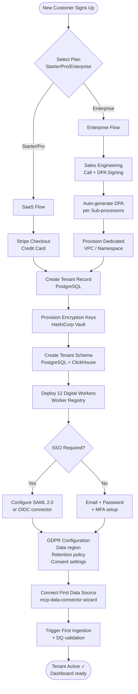
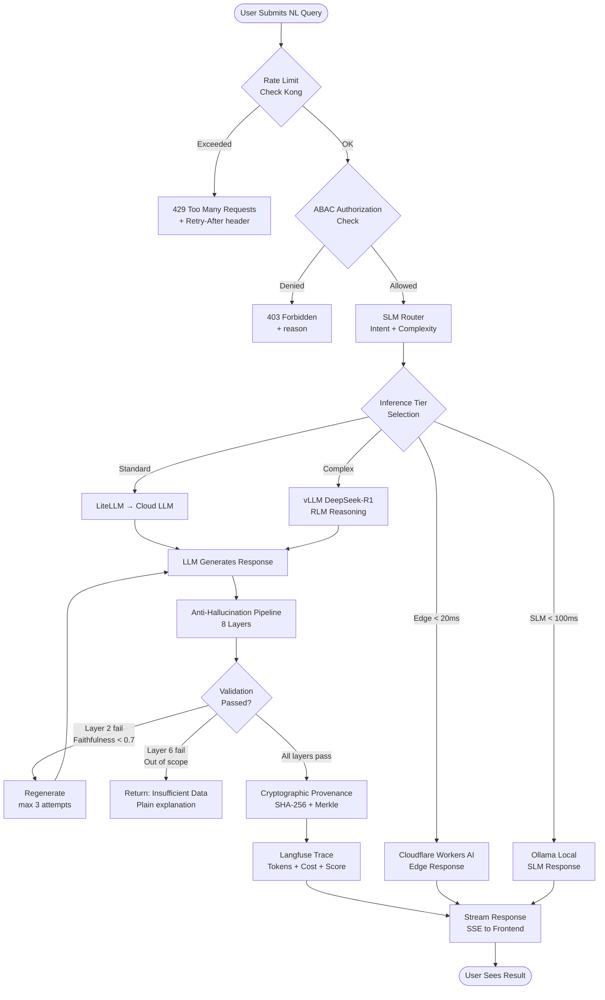
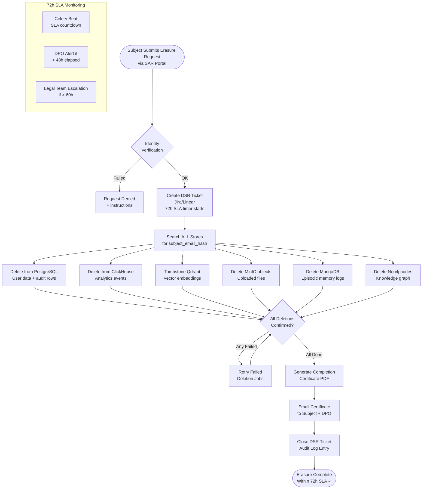
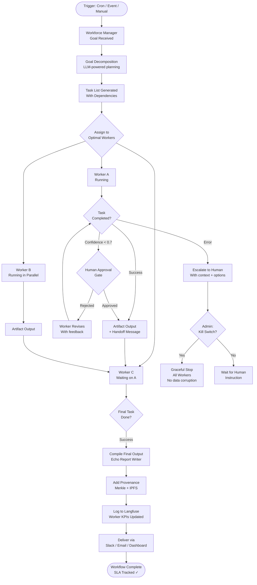

# Process Mapping — BPMN-Style Platform Workflows

> Maps every major operational process in DataMind using swimlane diagrams.
> Rendered with Mermaid flowcharts (BPMN notation).

---

## 1. New Tenant Onboarding Process



---

## 2. AI Query Processing Workflow (Happy Path + Error Paths)



---

## 3. Data Subject Rights (DSR) — Right to Erasure (Art. 17)



---

## 4. Digital Worker Autonomous Workflow Execution



---

## 5. CI/CD Pipeline — Code to Production

```mermaid
flowchart LR
    DEV([Developer Push\nto Feature Branch]) --> GH[GitHub PR Created]
    GH --> LINT[Lint + Type Check\npylint + mypy + eslint]
    LINT --> UNIT[Unit Tests\npytest + jest]
    UNIT --> SOLID_CHECK[SOLID Compliance\nimport-linter]
    SOLID_CHECK --> SEC[Security Scan\nSnyk + Trivy + Bandit]
    SEC --> BUILD[Docker Build\nMulti-stage, minimal]
    BUILD --> PUSH[Push to Registry\nECR / GCR / ACR]
    PUSH --> HELM_LINT[Helm Chart Lint\n+ Template Render]
    HELM_LINT --> INT_TEST[Integration Tests\nTestcontainers]
    INT_TEST --> REVIEW{Code Review\n2 approvers required}
    REVIEW -->|Changes Requested| REVISE[Developer Revises]
    REVISE --> GH
    REVIEW -->|Approved| MERGE[Merge to main]
    MERGE --> ARGOCD[ArgoCD Sync\nKubernetes Manifest]
    ARGOCD --> STAGING[Deploy to Staging\nSmoke Tests]
    STAGING --> LOAD[Load Test\nk6 — p99 < 2s]
    LOAD --> CANARY[Canary Deploy\n10% production traffic]
    CANARY --> METRICS{SLO Metrics\nOK for 30min?}
    METRICS -->|Error rate spike| ROLLBACK[Automatic Rollback\nArgoCD]
    METRICS -->|All green| FULL[Full Production Deploy\n100% traffic]
    FULL --> NOTIFY_DONE([Slack: Deploy ✓\nVersion + Changelog])
```



---

## 6. Model Fine-Tuning & Deployment Pipeline (MLOps)

```mermaid
flowchart TD
    TRIGGER([Trigger: Langfuse Score Drift\nor Manual Request]) --> DATA_CUR[Dataset Curation\nLangfuse golden pairs\nscore > 0.9]
    DATA_CUR --> SDV{Contains PII?}
    SDV -->|Yes| SYNTH[Generate Synthetic\nSDV / Gretel.ai]
    SDV -->|No| SPLIT[Train/Val/Test Split\n80/10/10]
    SYNTH --> SPLIT

    SPLIT --> MLFLOW[MLflow Experiment\nStart Run]
    MLFLOW --> AXOLOTL[Axolotl LoRA Fine-Tuning\nQLoRA 4-bit on A100]
    AXOLOTL --> EVAL[Eval on Test Set\nRAGAS + task-specific metrics]
    EVAL --> COMPARE{Better than\nBaseline?}
    COMPARE -->|No improvement| DISCARD[Discard Run\nLog reason to MLflow]
    COMPARE -->|Improved| MODEL_CARD[Auto-generate Model Card\nGoogle format]

    MODEL_CARD --> PQC[Sign with CRYSTALS-Dilithium\nTamper detection]
    PQC --> REGISTER[Register to MLflow\nModel Registry]
    REGISTER --> SHADOW[Shadow Deploy\n1% traffic alongside current]
    SHADOW --> A_B{A/B Langfuse\nEval 7 days}
    A_B -->|New model wins| PROMOTE[Promote to Production\nvLLM hot-reload]
    A_B -->|No improvement| ROLLBACK_M[Keep Current Model\nLog experiment]
    PROMOTE --> FEAST[Update Feast\nFeature Store version]
    FEAST --> NOTIFY_ML([Notify Team\nModel v{n} Deployed ✓])
```
